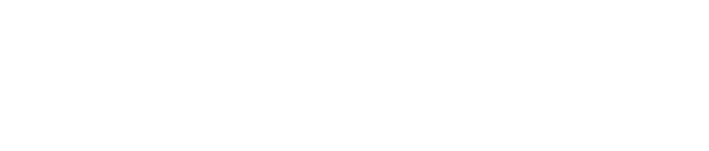
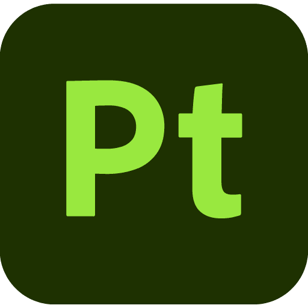
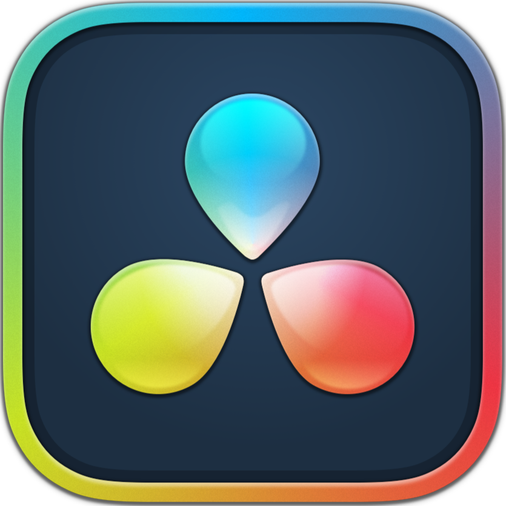

## Hi there 👋
Hey, I am Christian, Software developer, VFX Artist, TD.

🎓 B.Sc. Computer Science and Business 
🎓 Currently studying for B.Arts. VFX&Animation

 

 
A small (~30 awesome people) hobby Minecraft Machinima studio, yes we do that in our free time! 
Joined late 2021, now responsible for VFX creation and supervision, technical directing, software, RnD, pipeline tools/addons.
  

Currently developing a standalone animation software at [Minechinima](https://github.com/Minechinima), inspired by Blender's architecture, with high modularity for runtime extensibility via addons, layered data architecture for collaborative working in a multiplayer environment, with API to be integrated as a mod into Minecraft.

## 🛠️ Tools & Experience

### ⚡ Advanced

<table style="border-collapse: collapse; border: none;">
  <tr>
    <td align="center" style="border-collapse: collapse; border: none;">
       
      <!-- JAVA_YEARS_START -->6.2<!-- JAVA_YEARS_END --> years
    </td>
    <td align="center">
       
      <!-- PYTHON_YEARS_START -->5.2<!-- PYTHON_YEARS_END --> years
    </td>
    <td align="center">
       
      <!-- BLENDER_YEARS_START -->4.2<!-- BLENDER_YEARS_END --> years
    </td>
  </tr>
</table>

### 👍 Good

  

 

---

  

## 📊 Statistics

### 🌍 All Time

| Metric | Count |
|--------|-------|
| 💾 LOC Committed | <!-- TOTAL_LOC_START -->178,748<!-- TOTAL_LOC_END --> |
| 🔀 PRs Opened | <!-- TOTAL_PRS_START -->76<!-- TOTAL_PRS_END --> |
| 👀 Code Reviews | <!-- TOTAL_REVIEWS_START -->6<!-- TOTAL_REVIEWS_END --> |
| ✅ Commits | <!-- TOTAL_COMMITS_START -->992<!-- TOTAL_COMMITS_END --> |

### 📅 <!-- CURRENT_YEAR_START -->2026<!-- CURRENT_YEAR_END -->

| Metric | Count |
|--------|-------|
| 💾 LOC Committed | <!-- YEAR_LOC_START -->1,628<!-- YEAR_LOC_END --> |
| 🔀 PRs Opened | <!-- YEAR_PRS_START -->0<!-- YEAR_PRS_END --> |
| 👀 Code Reviews | <!-- YEAR_REVIEWS_START -->0<!-- YEAR_REVIEWS_END --> |
| ✅ Commits | <!-- YEAR_COMMITS_START -->9<!-- YEAR_COMMITS_END --> |
